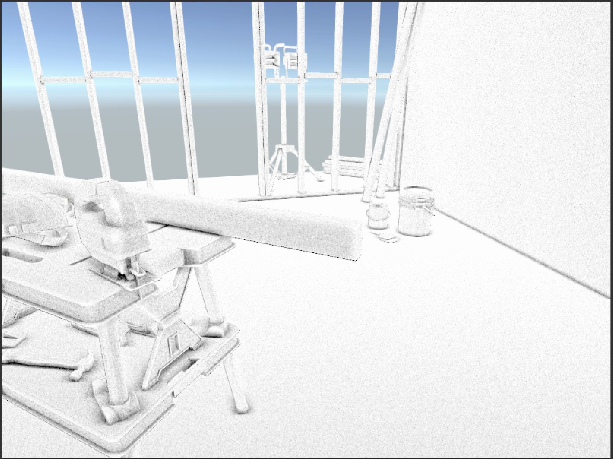
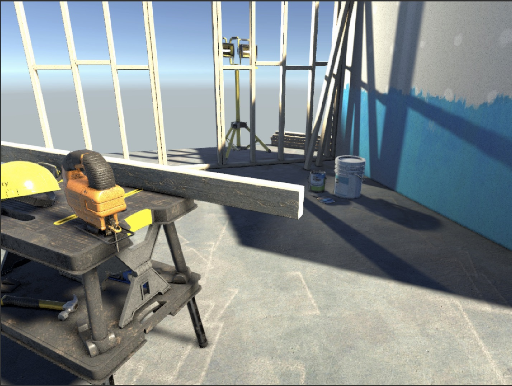
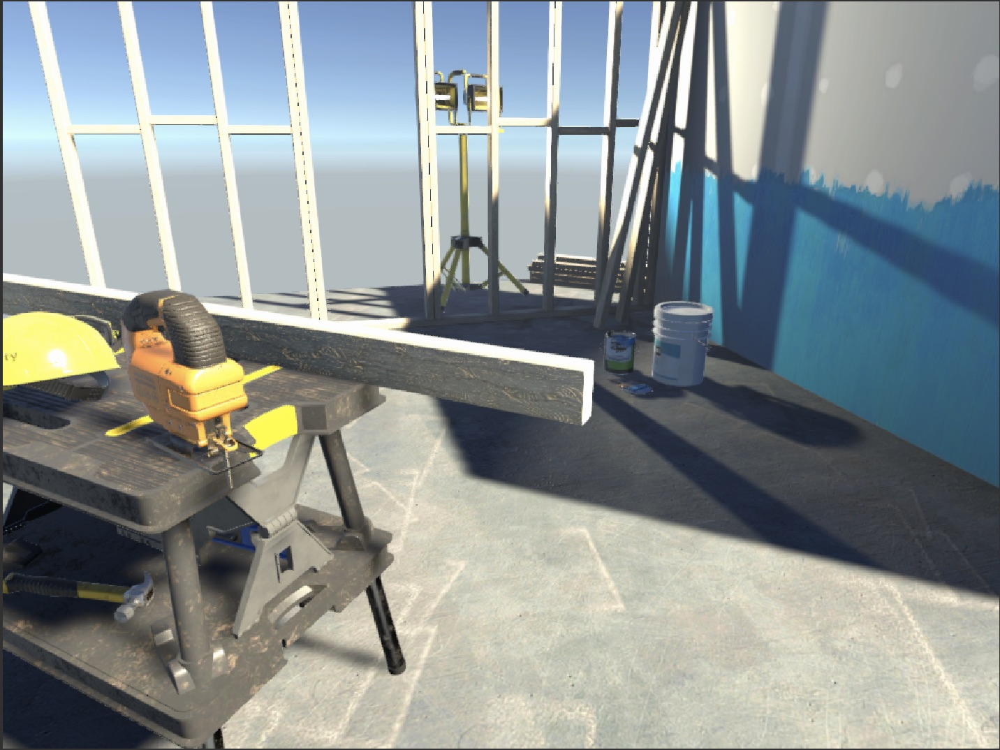

## URP Screen Space Ambient Occlusion Renderer Feature

This is a sample implementation for SSAO as a RendererFeature in URP. The shader is highly based on this [blog post](http://theorangeduck.com/page/pure-depth-ssao). This has been created for educational purposes, not for production.

Developed and tested on:
* Unity 2019.3.2f1
* Universal RP 7.1.8
* OSX 10.14

This is how it looks: 

Debug mode

SSAO active

SSAO inactive

### Usage
* create or open a URP project
* open "Package Manager"
* click on the "+" icon on the top right
* "Add package from git URL"
* paste "https://github.com/sebastianhein/urp-ssao.git" into the input field
* add new SSAO RendererFeature to the URP settings 
* manually assign "ssao" material to the feature settings
* "depth texture" must be enabled in the URP settings

### Known issues/TODOs:
* HDR doesn't work, the SSAO effect uses RGBA32 rendertexture. Needs a check if the current camera target is HDR enabled.
* The material does not get assiged automatically on creation of the RendererFeature.

